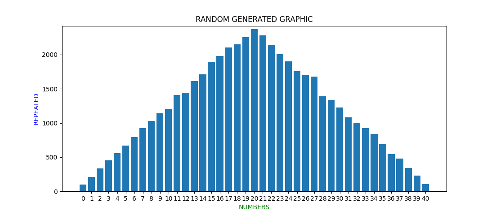

    
    <h1>📊RANDOMNESS📊</h1>
    

        
        
        
    

<h3 align="center">Application to generate graphs with random numbers</h3>
 

### Features
- [x] Create graphics

    

 

### Autor
---

<a href="https://github.com/mr-soulfox">
 
  
 <b>Marcos Paulo 🦊</b></a>

Feito com ❤️ por Marcos Paulo
